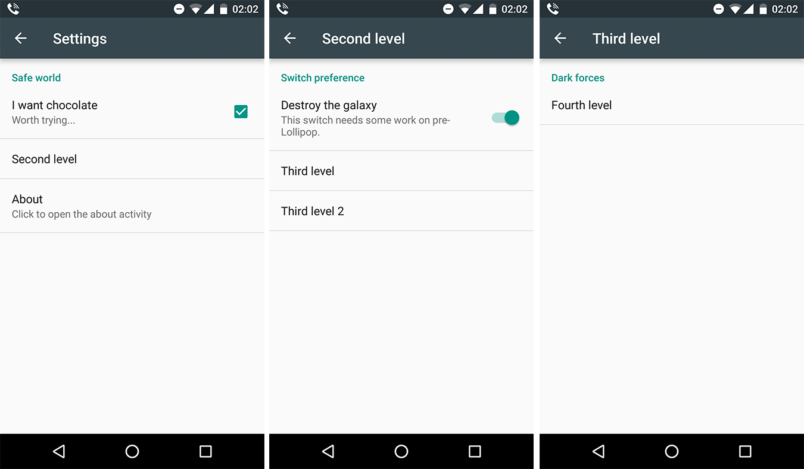

# material-preferences
[](https://travis-ci.org/ferrannp/material-preferences)

Making straightforward to create a preference screen on pre-Lollipop devices looking exactly as if it was a Lollipop one. API 7.


## Features
- Material look (title, summary, widgets...) on pre-Lollipop devices
- Nested PreferenceScreen with Toolbar and handling configuration change correctly (restore state)
- No API change (only trick for [SwitchPreference](README.md#switchpreference))

## Install (Gradle dependency)

    compile 'com.fnp:material-preferences:0.1.4'

## Usage

Please check the [sample project](sample) and the required steps below.

###styles
For pre-Lollipop devices you need to use a Theme with No Action Bar, add that in ```values/styles.xml```:
```xml
<style name="SettingsTheme" parent="AppBaseTheme">
    <item name="windowNoTitle">true</item>
    <item name="windowActionBar">false</item>
</style>
```

On the other hand, for Lollipop or above, you need to use a theme that has an ActionBar, add that in ```values-v21/styles.xml```:
```xml
<style name="SettingsTheme" parent="AppBaseTheme">
    <item name="windowNoTitle">false</item>
    <item name="windowActionBar">true</item>
    <item name="actionBarStyle">@style/AppTheme.actionBarStyle</item>
</style>

<!-- To follow the guidelines http://www.google.com/design/spec/layout/structure.html#structure-toolbars -->
<style name="AppTheme.actionBarStyle" parent="Widget.AppCompat.ActionBar">
    <item name="background">?attr/colorPrimary</item>
    <item name="contentInsetStart">72dp</item>
    <item name="contentInsetLeft">72dp</item>
</style>
```

### SettingsActivity
```java
public class SettingsActivity extends com.fnp.materialpreferences.PreferenceActivity {
    @Override
    public void onCreate(Bundle savedInstanceState) {
        super.onCreate(savedInstanceState);
        
        /**
         * We load a PreferenceFragment which is the recommended way by Android 
         * see @http://developer.android.com/guide/topics/ui/settings.html#Fragment
         * @TargetApi(11)
         */
        setPreferenceFragment(new MyPreferenceFragment());
    }

    public static class MyPreferenceFragment extends com.fnp.materialpreferences.PreferenceFragment {
        @Override
        public int addPreferencesFromResource() {
            return R.xml.preferences; // Your preference file
        }
    }
}
```

### PreferenceScreen XML
**IMPORTANT**: Use always an ```android:key``` in your ```PreferenceScreen(s)```, if not, the library won't be able to restore the state when a configuration change happens (like device rotation).

```xml
<PreferenceScreen xmlns:android="http://schemas.android.com/apk/res/android"
    android:key="settings"
    android:title="@string/settings">
    <!-- title will be used in the Toolbar -->
    <PreferenceCategory
        <!-- Any value from PreferenceCategory --> >
        <CheckBoxPreference
            <!-- Any value from CheckBoxPreference --> />
        </PreferenceCategory>
</PreferenceScreen>
```

### SwitchPreference
There is a trick for ```SwitchPreference```, instead, use a ```CheckBoxPreference``` and use the ```@layout/mp_preference_switch``` as a widget layout. For now, this is the only way to style it.

```xml
<CheckBoxPreference
    android:defaultValue="true"
    android:key="some_key"
    android:title="Hooray!"
    android:widgetLayout="@layout/mp_preference_switch"/>
```

## Result


## Beware: Do not override library resources intentionless
Check the [resources](library/src/main/res) folder, if you use in your project a resource with the same name as this library, for example, "mp_preference_material.xml", your resource will have preference and that might cause the library to fail if you are not doing this intentionally.

More info: https://developer.android.com/tools/projects/index.html#considerations (see "Resource conflicts")

## Known apps using this library
- [Audio Profiles](https://play.google.com/store/apps/details?id=com.fnp.audioprofiles)
